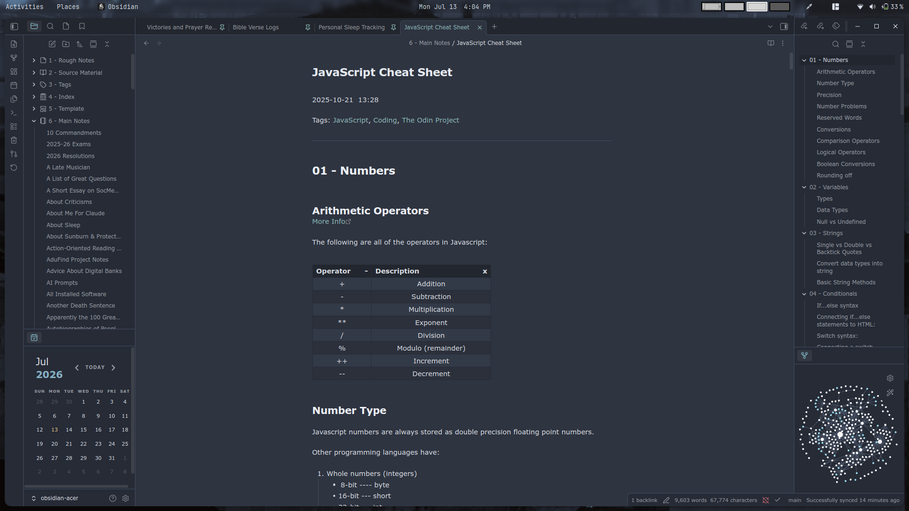
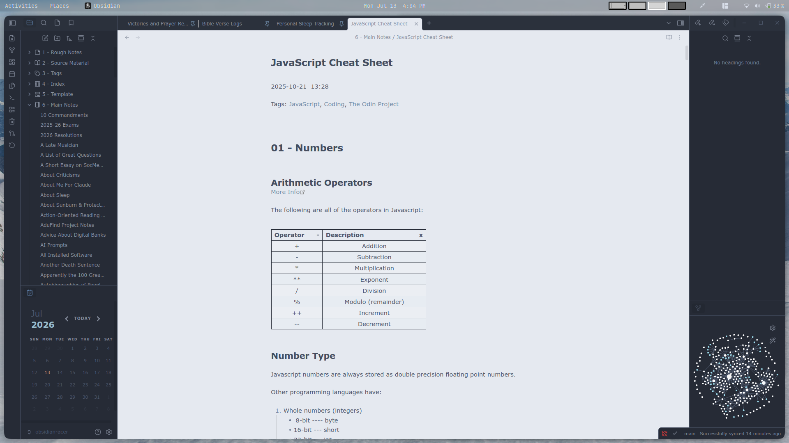

# Another Nord Theme for Obsidian

This is another [Nord](https://github.com/arcticicestudio/nord) theme for [Obsidian](https://obsidian.md), based on [Insanum's original work](https://github.com/insanum/obsidian_nord). 

Apply a Nord-inspired color scheme with cool blue-gray tones and gentle contrast. Maintain readable syntax highlighting and subtle UI accents across panes for a calm, focused writing environment.

## Preview

## Installation
1. Open **Settings** in Obsidian.
2. Go to **Appearance** > **Themes** and click **Manage**.
3. Search for `Another Nord`.
4. Click **Install and use**.

## Usage & Customization
This theme natively supports both **Light** and **Dark** modes. You can toggle between them in Obsidian's Appearance settings.

### Customization via Style Settings
To unlock deep customization options (such as changing specific colors, fonts, and layouts), it is highly recommended to use the **Style Settings** plugin:

1. Install and enable the [Style Settings](https://obsidian.md) community plugin.
2. Go to **Settings** > **Style Settings**.
3. Expand the section for `Another Nord` to tweak individual color palettes, typography, and accent choices to your liking.
